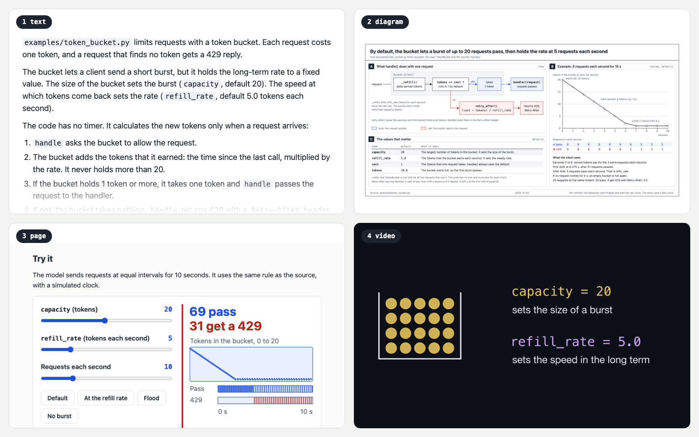
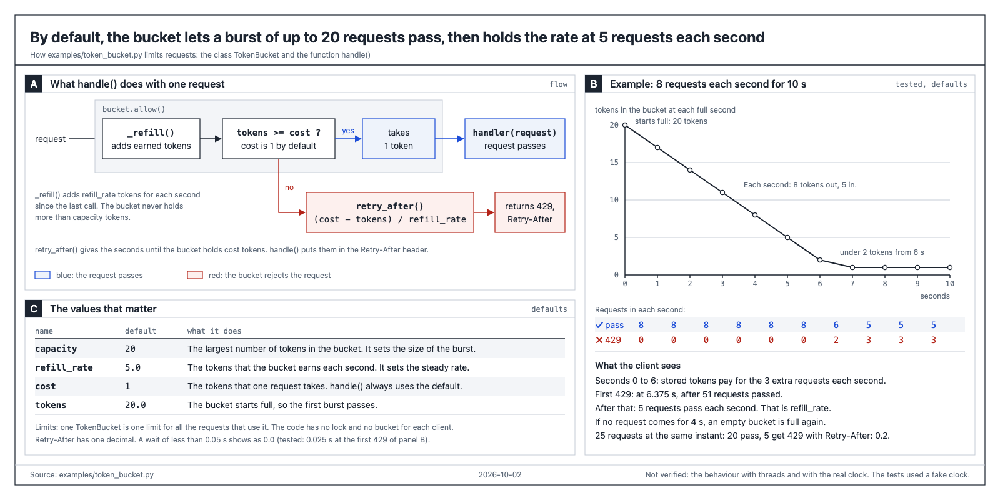
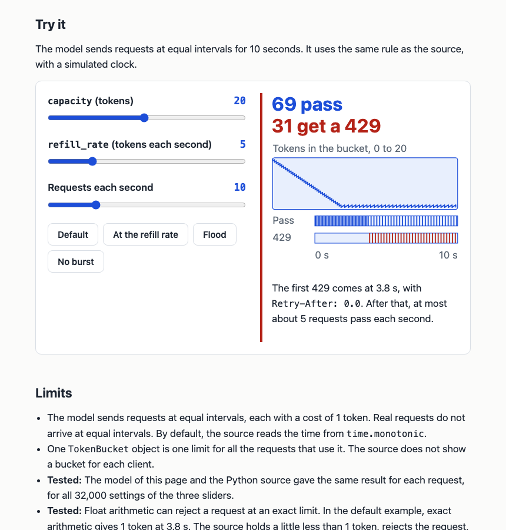
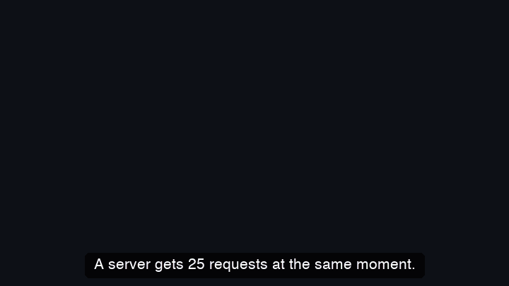

# demystify

Ask your coding agent to explain something, and get the answer in whichever form is easiest to take in: plain text, a diagram, a page you can play with, or a short narrated video.



## Where this comes from

Andrej Karpathy [wrote](https://x.com/karpathy/status/2105819303471976479) that we will be spending a lot more time trying to understand what language models produce. He listed four ways to ask a model for an explanation, each better than the one before:

1. Writing, in the stripped-down English of aircraft maintenance manuals (ASD-STE100).
2. A diagram instead of writing.
3. A web page: interactive, in HTML.
4. An explainer video, made from scratch for your exact question.

demystify is that list as one skill. Say what you want explained. It picks the lightest format that gets the point across, or you pick one yourself.

## See it

Everything in this section explains the same file: [`examples/token_bucket.py`](examples/token_bucket.py), a 45-line rate limiter. Each result came from the one-line request above it, and nobody touched it up afterwards.

### Text

```text
/demystify text: how examples/token_bucket.py limits requests
```

> `examples/token_bucket.py` limits requests with a token bucket. Each request costs one token, and a request that finds no token gets a 429 reply.
>
> The bucket lets a client send a short burst, but it holds the long-term rate to a fixed value. The size of the bucket sets the burst (`capacity`, default 20). The speed at which tokens come back sets the rate (`refill_rate`, default 5.0 tokens each second).
>
> The code has no timer. It calculates the new tokens only when a request arrives.

It goes on with the steps, an example it ran against the real code, and the limits. [Read the whole answer](examples/token-bucket/text.md). It took 39 seconds.

### Diagram

```text
/demystify diagram: how examples/token_bucket.py limits requests
```

[](examples/token-bucket/diagram.svg)

One SVG file. The numbers in the example panel come from running the code, not from guessing. About three and a half minutes.

### Page

```text
/demystify page: how examples/token_bucket.py limits requests
```

[](examples/token-bucket/page.html)

One HTML file with nothing to install. [Download it](examples/token-bucket/page.html), open it, and drag the sliders. Before it handed the page over, the agent ran the page's little simulation against the real Python on all 32,000 slider settings and got the same answer every time. Five minutes.

### Video

```text
/demystify video: how examples/token_bucket.py limits requests
```



That is a silent preview. [The real one](examples/token-bucket/video.mp4) is 81 seconds long and has a voice. Ten minutes.

## Install

The easy way is to let your agent do it. Paste this:

```text
Install the demystify skill from https://github.com/C0ldSmi1e/demystify and follow the AGENTS.md in that repository.
```

Or run the commands yourself.

**Claude Code**

```bash
claude plugin marketplace add C0ldSmi1e/demystify
claude plugin install demystify@demystify
```

**Codex**

```bash
codex plugin marketplace add C0ldSmi1e/demystify
codex plugin add demystify@demystify
```

**Gemini CLI**

```bash
gemini extensions install https://github.com/C0ldSmi1e/demystify
```

**Cursor, GitHub Copilot, OpenCode and most others**

```bash
npx skills@latest add C0ldSmi1e/demystify
```

Updating, removing, and what has and has not been tested: [INSTALL.md](INSTALL.md).

## How to ask

Type `/demystify` and say what you want explained. In Codex it is `$demystify`.

```text
/demystify why the nightly job fails only on Mondays
/demystify diagram: the request path through src/server
/demystify page: how our retry backoff behaves under load
/demystify video: what this pull request changes
```

Start with `text`, `diagram`, `page` or `video` to choose the format. Leave it out and the skill chooses. It never starts a video on its own, because a video takes a while. It offers one instead.

You do not have to use the command. "Draw me a diagram of how this works" or "make an explainer video about X" does the same thing.

For text, add `strict` if you want the full rules. The default is a softer 80%, which keeps the short sentences and drops the fixed vocabulary.

Results land in a `demystify-out/` folder in your project. The folder ignores itself in git, so it never shows up in a commit.

## It checks its own work

An explanation that looks right and is wrong is worse than no explanation. So every format ends with a check, and the check looks at the result the way you would.

- **Text.** A script counts the words in every sentence and the sentences in every paragraph.
- **Diagram.** The drawing is opened in a real browser and measured: text that overlaps other text, text that spills out of its box, an arrow that lost its head. Then the agent looks at the picture.
- **Page.** The same, at desktop width and at phone width. Every button gets pressed and every slider gets dragged, to see what breaks and what makes the page jump. The numbers on the page are compared with the real code.
- **Video.** A quick draft is rendered first. The text on screen is measured after every animation, two frames are pulled from every beat, and the agent looks at them before the final render.

It runs the code it explains when that is safe, and it marks what it only inferred. It also tells you what it could not check. It cannot hear, so after a video it asks you to listen once.

## What you need

For text, diagrams and pages: nothing. If Chrome, Chromium, Edge or Brave is installed, the skill uses it to look at what it drew. Without one, it tells you that nobody looked.

For video, two things have to be on your machine:

- `uv`, which runs the animation library and the voice in throwaway environments. Nothing is installed for good.
- The cairo graphics library. On a Mac that is `brew install cairo pkg-config`.

Ask your agent to "run the demystify doctor" and it will tell you what is missing and how to fix it. It will not install anything without asking.

The voice is the best one available, in this order:

1. ElevenLabs, if you have set `ELEVENLABS_API_KEY`. The key is only read from your environment.
2. Kokoro, a free voice that runs on your own machine. It is a one-time 354 MB download, and you get asked first.
3. The voice built into macOS.
4. No voice: a silent video with subtitles.

You do not need LaTeX or ffmpeg.

## Does it help?

Here is what happened when the same requests ran with and without the skill, three times each on Claude Sonnet 5.5, with every result measured in a real browser.

- **Pages** gained the most. Without the skill, every page jumped when you dragged a slider and had chart labels too small to read on a phone: about 13 problems a page. With it, none.
- **Diagrams** were laid out fine either way. The difference is what they say. With the skill, all three had a worked example with real numbers and a note of what was tested. Without it, none did.
- **Text** came out with the answer in the first line, instead of under seven or eight headings.
- **It costs more.** About three times the price and the wait: $0.38 and two minutes for a page, against $0.13 and 40 seconds.

That is three runs a side on one small file, so read it as a hint and not as proof. The method, the numbers and their limits are in [evals/RESULTS.md](evals/RESULTS.md).

## Tested on

macOS, with real runs and with the test suite. Linux runs in CI. Windows has not been tried, and neither has the ElevenLabs voice.

## License

MIT
